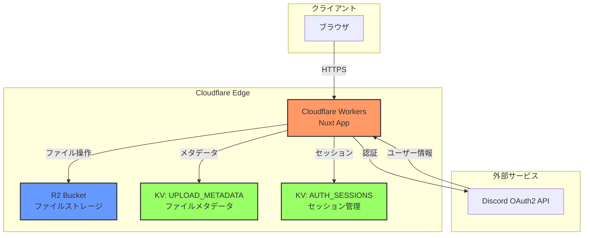

# leciel Flare

**Cloudflare R2**を活用した高性能ファイルストレージ・配信システム

## 📋 概要

leciel Flareは、Cloudflare Workers、R2、KVを使用して構築されたモダンなファイルストレージ・管理システムです。Discord OAuthによる認証機能を備え、エッジでの高速なファイル配信とシームレスな管理機能を提供します。

### 主な機能

- 🔐 **Discord OAuth認証** - Discordアカウントによるセキュアな認証
- 📁 **直感的なファイル管理** - ディレクトリベースのファイル・フォルダ管理
- ⚡ **高速配信** - Cloudflare Edgeネットワークによるグローバルな高速配信
- 🎨 **モダンUI** - Nuxt UI + Tailwind CSSによる洗練されたインターフェース
- 🌓 **ダークモード対応** - ライト/ダーク両対応のテーマ切り替え
- 📤 **ドラッグ&ドロップアップロード** - 直感的なファイルアップロード機能
- 🔒 **Discordギルド制限** - 特定のDiscordサーバーメンバーのみアクセス可能

### 使用技術スタック

#### フロントエンド
- **Nuxt 4** - Vue.jsベースのフルスタックフレームワーク
- **Vue 3** - プログレッシブなJavaScriptフレームワーク
- **Nuxt UI** - Nuxt専用UIコンポーネントライブラリ
- **Tailwind CSS** - ユーティリティファーストCSSフレームワーク
- **VueUse** - Vue Composition APIユーティリティ集
- **TypeScript** - 型安全な開発環境

#### バックエンド
- **Cloudflare Workers** - エッジコンピューティングプラットフォーム
- **Cloudflare R2** - S3互換オブジェクトストレージ
- **Cloudflare KV** - キーバリューストレージ
- **Nitro** - サーバーエンジン
- **nuxt-auth-utils** - 認証ユーティリティ

## 🏗️ アーキテクチャ

### システム構成図



### ディレクトリ構造

```
leciel-flare/
├── app/                      # Nuxtアプリケーション層
│   ├── assets/              # 静的アセット（CSS等）
│   ├── components/          # Vueコンポーネント
│   │   ├── common/         # 共通コンポーネント
│   │   ├── directory/      # ディレクトリ表示コンポーネント
│   │   ├── modal/          # モーダルコンポーネント
│   │   └── upload/         # アップロード関連コンポーネント
│   ├── composables/         # Vue Composition API
│   ├── layouts/             # レイアウトテンプレート
│   ├── pages/               # ページコンポーネント（ルーティング）
│   ├── types/               # フロントエンド型定義
│   └── utils/               # フロントエンドユーティリティ
│
├── server/                   # サーバーサイドロジック
│   ├── api/                 # APIエンドポイント
│   │   ├── auth/           # 認証関連API
│   │   ├── files/          # ファイル操作API
│   │   ├── folders/        # フォルダ操作API
│   │   └── directories/    # ディレクトリ一覧API
│   ├── routes/              # カスタムルート
│   │   └── file/           # ファイル配信ルート
│   ├── middleware/          # サーバーミドルウェア
│   ├── plugins/             # サーバープラグイン
│   ├── config/              # サーバー設定
│   ├── types/               # サーバーサイド型定義
│   └── utils/               # サーバーユーティリティ
│
├── public/                   # 公開静的ファイル
├── docs/                     # ドキュメント
├── scripts/                  # ビルド・デプロイスクリプト
├── nuxt.config.ts           # Nuxt設定
├── wrangler.toml            # Cloudflare Workers設定
└── package.json             # パッケージ管理
```

## 🚀 開発環境セットアップ

### 前提条件

- **Node.js** 20.x以上
- **npm** / **pnpm** / **yarn** / **bun**
- **Cloudflareアカウント**
- **Discordアプリケーション**（OAuth2用）

### 1. 依存関係のインストール

```bash
# npm
npm install

# pnpm
pnpm install

# yarn
yarn install

# bun
bun install
```

### 2. Cloudflare Wranglerの設定

#### 2.1 設定ファイルの作成

```bash
cp wrangler.toml.example wrangler.toml
```

#### 2.2 Cloudflareリソースの作成

```bash
# KV namespaces を作成
npx wrangler kv namespace create UPLOAD_METADATA
npx wrangler kv namespace create AUTH_SESSIONS

# R2 bucket を作成
npx wrangler r2 bucket create flare-bucket
```

#### 2.3 `wrangler.toml` の設定

作成したリソースのIDを確認：

```bash
npx wrangler kv namespace list
npx wrangler r2 bucket list
```

`wrangler.toml` の `[env.production]` セクションを実際の値に置き換えます：

- `bucket_name`: 作成したR2バケット名
- KV namespace `id`: 作成したKVネームスペースのID

### 3. 環境変数の設定

#### 3.1 環境変数ファイルの作成

```bash
cp .env.example .env
```

#### 3.2 Discord OAuth2アプリケーションの設定

1. [Discord Developer Portal](https://discord.com/developers/applications) でアプリケーションを作成
2. **OAuth2** → **General** でリダイレクトURLを追加：
   - 開発環境: `http://localhost:3000/api/auth/discord/callback`
   - 本番環境: `https://YOUR_DOMAIN/api/auth/discord/callback`
3. **Client ID** と **Client Secret** を取得

#### 3.3 セッション暗号化キーの生成

```bash
openssl rand -base64 32
```

#### 3.4 `.env` ファイルの編集

```env
# Discord OAuth2
NUXT_OAUTH_DISCORD_CLIENT_ID=your_discord_client_id
NUXT_OAUTH_DISCORD_CLIENT_SECRET=your_discord_client_secret
NUXT_DISCORD_GUILD_ID=your_discord_server_id

# セッション暗号化キー
NUXT_SESSION_PASSWORD=generated_base64_string

# サイトURL
NUXT_PUBLIC_SITE_URL=http://localhost:3000
```

### 4. 開発サーバーの起動

```bash
# npm
npm run dev

# pnpm
pnpm dev

# yarn
yarn dev

# bun
bun run dev
```

ブラウザで [http://localhost:3000](http://localhost:3000) にアクセスしてください。

## 📦 本番環境デプロイ

### 1. 本番環境のシークレット設定

機密情報は `wrangler secrets` コマンドで管理します：

```bash
# Discord Client Secret
npx wrangler secret put NUXT_OAUTH_DISCORD_CLIENT_SECRET --env production

# セッション暗号化キー
npx wrangler secret put NUXT_SESSION_PASSWORD --env production
```

### 2. wrangler.toml の本番環境設定

`[env.production.vars]` セクションで公開可能な環境変数を設定：

```toml
[env.production.vars]
NUXT_PUBLIC_SITE_URL = "https://cdn.leciel.net"
NUXT_OAUTH_DISCORD_CLIENT_ID = "your_client_id"
NUXT_DISCORD_GUILD_ID = "your_guild_id"
```

### 3. ビルドとデプロイ

```bash
# ビルド
npm run build

# デプロイ
npm run deploy

# または一括実行
npm run deploy
```

### 4. デプロイ後の確認

- Cloudflare Dashboardでデプロイ状況を確認
- 本番URLにアクセスして動作確認
- Discord OAuthのリダイレクトURLが正しく設定されているか確認

## 🔌 API仕様（簡易版）

### 認証関連

| エンドポイント | メソッド | 説明 |
|--------------|---------|------|
| `/api/auth/discord` | GET | Discord OAuth開始 |
| `/api/auth/discord/callback` | GET | OAuthコールバック |
| `/api/auth/session` | GET | セッション情報取得 |
| `/api/auth/logout` | POST | ログアウト |

### ファイル操作

| エンドポイント | メソッド | 説明 |
|--------------|---------|------|
| `/api/upload` | POST | ファイルアップロード |
| `/api/files/:path` | GET | ファイル情報取得 |
| `/api/files/:path` | DELETE | ファイル削除 |
| `/file/:path` | GET | ファイル配信（CDN） |

### ディレクトリ操作

| エンドポイント | メソッド | 説明 |
|--------------|---------|------|
| `/api/directories` | GET | ルートディレクトリ一覧 |
| `/api/directories/:path` | GET | 指定ディレクトリ一覧 |
| `/api/folders/:path` | POST | フォルダ作成 |
| `/api/folders/:path` | DELETE | フォルダ削除 |

### 詳細仕様

詳細なAPI仕様については [docs/](docs/) ディレクトリを参照してください。

## 🔧 開発時の注意事項

### 認証について

- 開発環境では `NUXT_DISCORD_GUILD_ID` で指定したDiscordサーバーのメンバーのみアクセス可能
- 開発用のバイパス機能は実装していません（セキュリティ考慮）

### ファイルアップロード制限

- デフォルトの最大ファイルサイズ: **500MB**
- 環境変数 `MAX_UPLOAD_SIZE` で変更可能
- 許可されるMIMEタイプ: 画像、動画、音声、PDF、テキスト、ZIP

### ローカルストレージ

- 開発環境ではローカルのR2/KVエミュレータを使用
- 本番環境と開発環境でデータは独立

## 📝 ライセンス

このプロジェクトは [BSD-3-Clause License](LICENSE) の下で公開されています。
